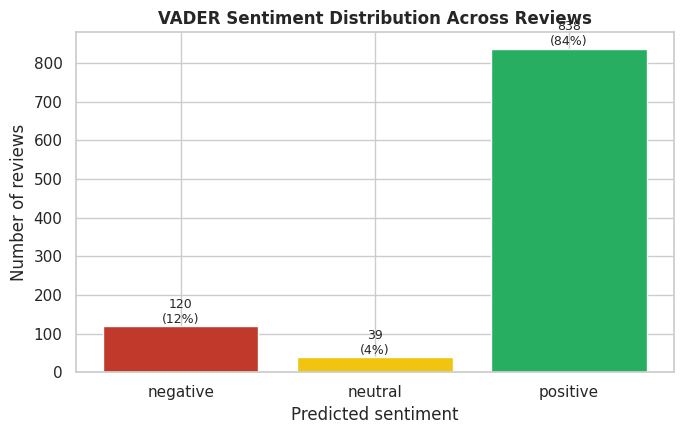
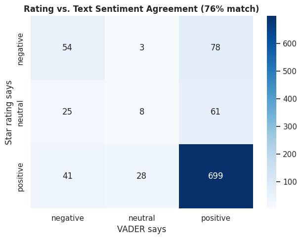
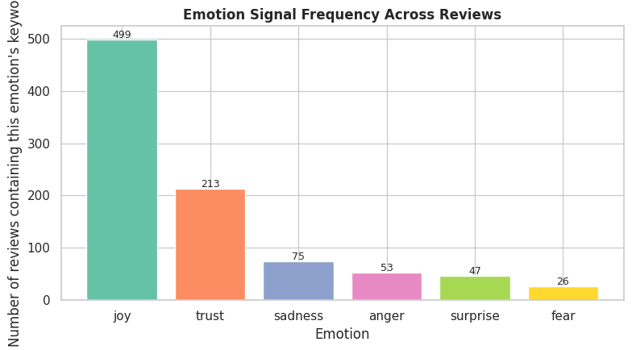
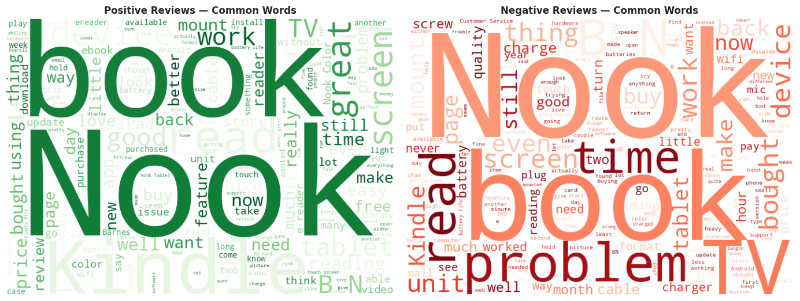
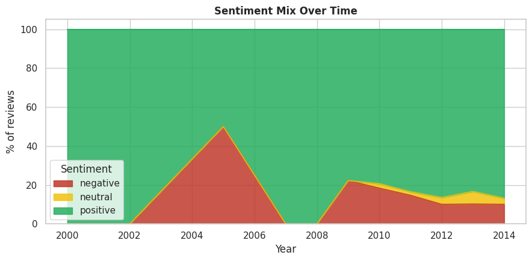

# 💬 Sentiment Analysis — Amazon Product Reviews

A sentiment and emotion analysis project built as part of the **CodeAlpha Data Analytics Internship**, classifying Amazon review text as positive/negative/neutral, digging into specific emotions, and checking whether automated sentiment agrees with the star rating customers actually gave.

## 📋 Overview

**Goal:** classify review text using a lexicon-based approach (no training data needed), go a level deeper into specific emotions, and turn the results into something a marketing or product team could actually use.

**Questions this project answers:**

1. Can review text be reliably classified as positive/negative/neutral using a lexicon-based approach?
2. Does the sentiment score agree with the customer's star rating — and where do the two disagree?
3. What specific emotions show up most in positive vs. negative reviews?
4. What language actually drives positive vs. negative sentiment (word-level)?
5. What would this mean for a marketing/product team?

**Method:** [VADER](https://github.com/cjhutto/vaderSentiment) (Valence Aware Dictionary and sEntiment Reasoner) — a lexicon- and rule-based sentiment tool tuned for informal, review-style text (handles negation, intensifiers like "very", punctuation emphasis, etc.). It runs fully offline with no model training required.

## 🛠️ Built With

- [pandas](https://pandas.pydata.org/) — data handling
- [VADER Sentiment](https://github.com/cjhutto/vaderSentiment) — lexicon-based sentiment scoring
- [Matplotlib](https://matplotlib.org/) / [Seaborn](https://seaborn.pydata.org/) — charts
- [WordCloud](https://github.com/amueller/word_cloud) — word cloud generation
- Jupyter Notebook

## 📦 Installation

```bash
git clone https://github.com/your-username/your-repo-name.git
cd your-repo-name
pip install pandas matplotlib seaborn vaderSentiment wordcloud jupyter
```

## ▶️ Usage

Make sure the cleaned dataset from Task 2 is available, then open and run the notebook:

```bash
jupyter notebook Task4_Sentiment_Analysis.ipynb
```

Charts are saved to `outputs/`, and the final labeled dataset is saved to `outputs/amazon_reviews_with_sentiment.csv`.

## 📊 Charts & Findings

**1. Sentiment distribution**

VADER classifies 84% of reviews as positive, 12% as negative, and 4% as neutral — closely tracking the 58%-positive skew seen in the star ratings from Tasks 2–3.

**2. Rating vs. text sentiment agreement**

Text sentiment and star rating agree 76% of the time. The most interesting cell is the 41 reviews rated positively by stars but read as negative in text — real but minor complaints customers tolerated without dropping their rating.

**3. Emotion frequency**

"Joy" (499 reviews) and "trust" (213) dominate the emotional signal, consistent with the positive skew — but "sadness" and "anger" keywords still appear in a meaningful minority and cluster in the longer, more detailed reviews flagged during EDA.

**4. Word clouds — positive vs. negative**

Positive reviews cluster around words like "great," "easy," and "read," while negative reviews surface recurring pain points like "problem," "charge," "screen," and "customer service" — a ready-made list of what to praise vs. fix.

**5. Sentiment mix over time**

The positive share has stayed dominant as review volume scaled up from 2009 onward, though the negative/neutral share ticks up slightly in 2012–2014 — worth monitoring as an early-warning signal.

## 💡 Business Insights

1. **Agreement is high (76%), but the disagreements are where the value is** — text-negative/rating-positive reviews are prime candidates for a product-improvement backlog, since the customer already described the issue without abandoning the product.
2. **Joy and trust dominate**, but sadness/anger keywords concentrate in the longest reviews — meaning the most detailed feedback skews disproportionately negative-emotion.
3. **Word clouds reveal *what* people praise or complain about**, not just polarity — directly useful for marketing copy and product-fix priorities.
4. **Sentiment-over-time tracking catches shifts early**, before they show up in sales or return-rate numbers.
5. **Recommended next step:** route the "high rating + negative text" segment to product/QA as a prioritized review queue, and mine the positive word cloud for marketing copy testing.

## 📁 Project Structure

```
.
├── Task4_Sentiment_Analysis.ipynb        # Main sentiment analysis notebook
├── data/
│   └── amazon_reviews_clean.csv          # Cleaned dataset (from Task 2)
├── outputs/
│   ├── amazon_reviews_with_sentiment.csv # Final dataset with sentiment + emotion labels
│   ├── sent1_sentiment_distribution.png
│   ├── sent2_agreement_heatmap.png
│   ├── sent3_emotion_frequency.png
│   ├── sent4_wordclouds.png
│   └── sent5_sentiment_over_time.png
└── README.md
```

## 📄 License

This project is open source and available under the [MIT License](LICENSE).

## 🙋 Author

Created as part of the **CodeAlpha Data Analytics Internship** program.
